# Taller Docker y AWS
## AREP
## [Diego Leon](https://github.com/diegoleonb)
## 2022-2

### Descripción

Este taller consiste en la creación de una aplicación web que por medio de LogService que es un servicio REST recibe una cadena, la almacena en la base de datos y responde con las 10 ultimas cadenas almacenadas y la fecha en la que se almacenaron. Utilizando el framework Spark y desplegada en un contenedor Docker. La aplicación web se desplegará en una instancia EC2 de AWS.

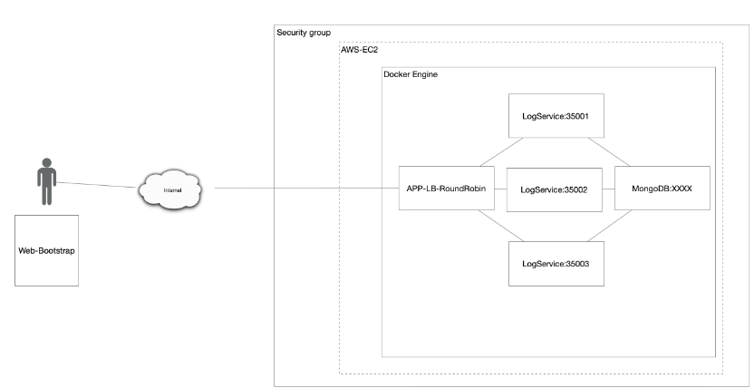

### Pre-requisitos

- [Java](https://www.java.com/es/download/)
- [Maven](https://maven.apache.org/download.cgi)
- [Docker](https://docs.docker.com/get-docker/)
- En caso de desplegarlo en AWS se necesita una cuenta de AWS y crear la instancia EC2.
  
### Compilación y ejecución

Para compilar el proyecto se debe ejecutar el siguiente comando en la carpeta raíz del proyecto:

```
cd logService
mvn package
```

Igualmente para roundRobin:
    
```
cd roundRobin
mvn package
```

Y desde la carpeta raíz del proyecto para desplegar el contenedor de Docker:

```
docker-compose up -d --build
```

Para acceder a la aplicación web se debe ingresar a la siguiente dirección:

```http://localhost:35000/```


### Tree

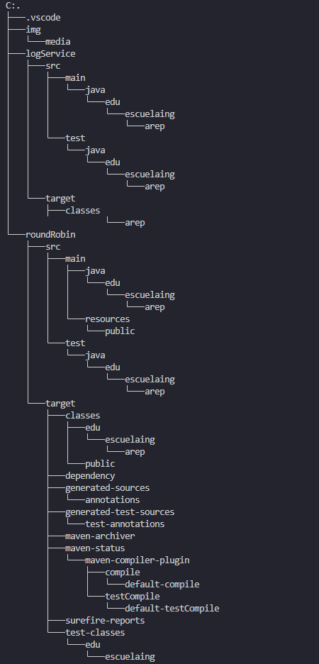

### Procedimiento

Se hace mvn package para logService y roundRobin.

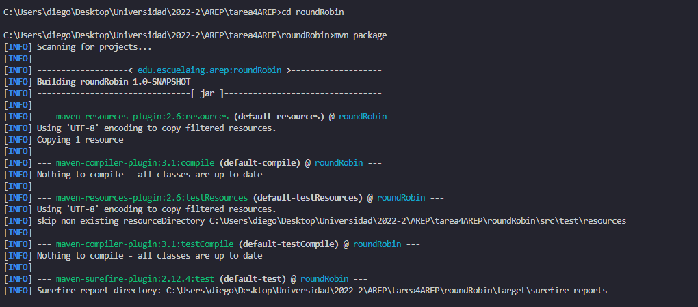

Se crea el archivo Dockerfile para logService y roundRobin. Posteriormente se crean las imagenes.

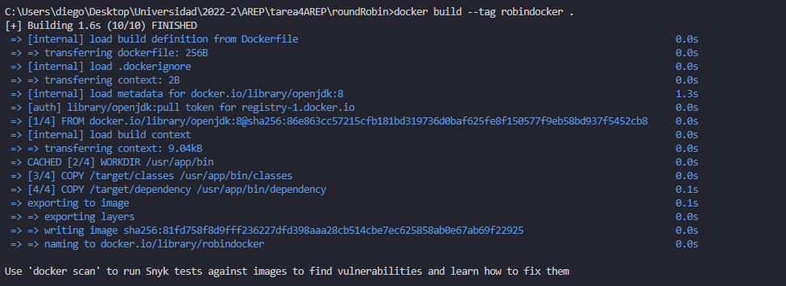

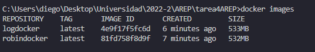

Se crean los contenedores.

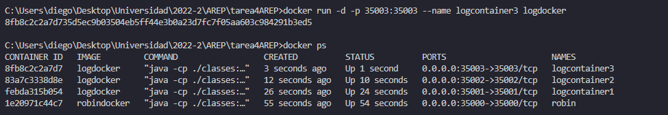

Con el fin de evitar la realizacion de las imagenes y contenedores manuelmente se crea el archivo docker-compose.yml. Y se ejecuta el comando docker-compose up -d --build.(Se deben eliminar las images y los contenedores creados anteriormente o no se puede realizar la creacion del contenerdor por docker-compose).

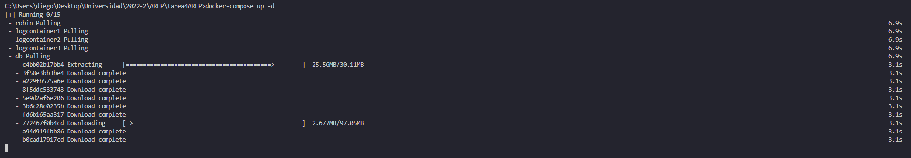

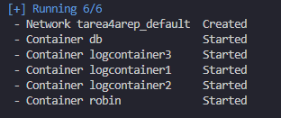

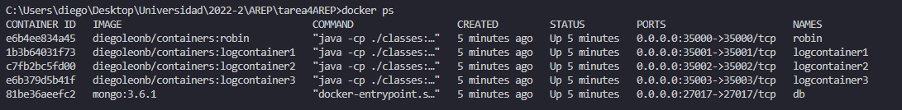

Se accede a la aplicación web.

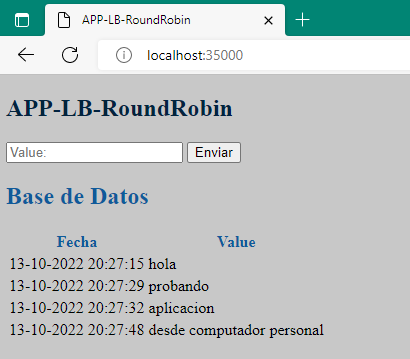

### Despliegue en AWS

Se crea una instancia EC2 en AWS.

Una vez creada accedemos a ella por medio de la terminal e instalamos docker.

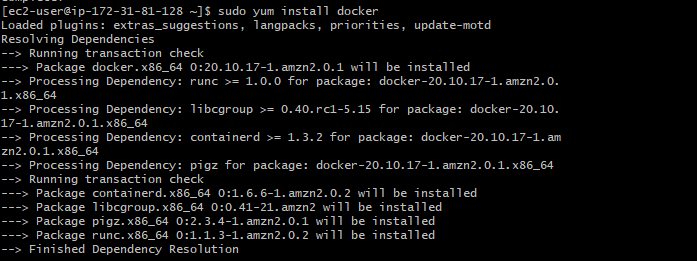

Accedemos a la instancia por medio de sftp y nos traemos el proyecto en formato zip por medio del comando put.

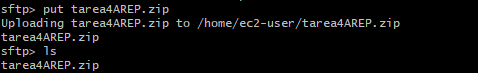

Descomprimimos el proyecto.

Para poder desplegar el contenedor tenemos que primero descargar docker-compose.

Para desplegar el contenedor de Docker:

```docker-compose up -d --build```

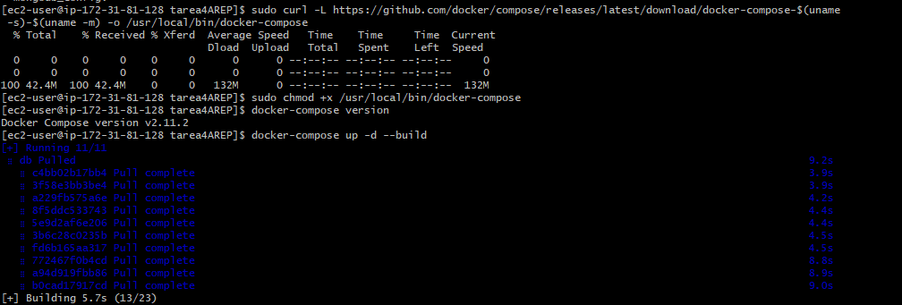

Podemos verificar que se han creado nuestras imagenes y contenedores.

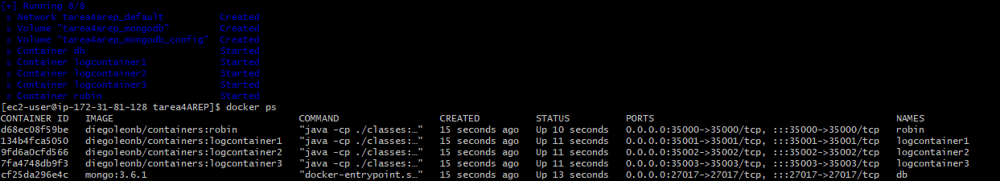

Por ultimo, accedemos a la aplicación web.

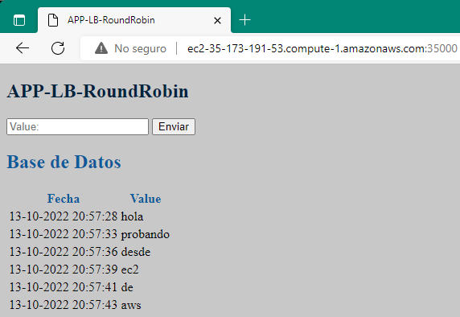


## Licencia

[LICENCIA](License.txt)
